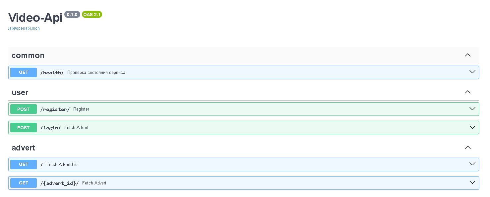
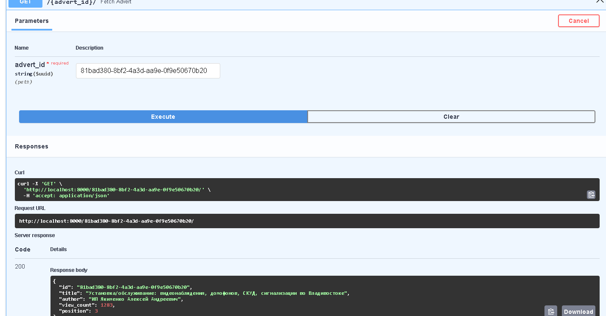
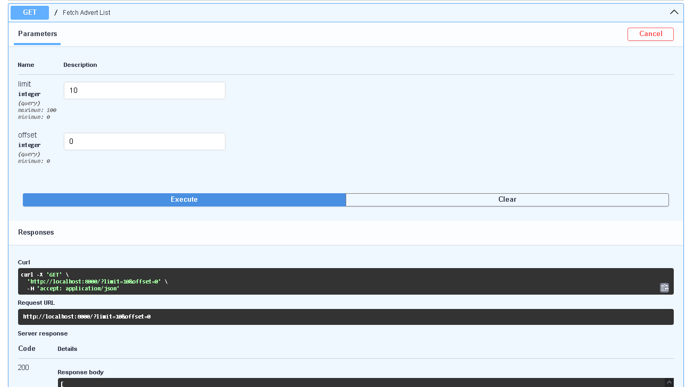
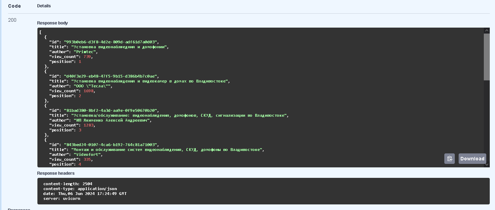
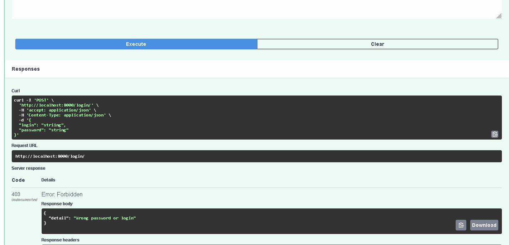

# Описание

API-сервис для получения данных с сайта FarPost

# Настройка

1. Необходимо скопировать sample.env в docker-compose/.env. Для этого выполните команду `make env`

# Запуск

1. `make storages` - запустить PostgreSQL
2. `make app` - запустить приложение
3. `make down-all` - закрыть

# Проверка работоспособности

При следовании инструкции, на локальном хосте должен открыться порт 8000.

Swagger доступен по URL: `http://localhost:8000/api/docs/`

# Реализованные дополнительные требования

1. Приложение построено, следуя принципам слоистой архитектуры
2. Использовалась ORM SQLALchemy
3. Добавлена регистрация, аутентификация, авторизация пользователей, используя сессии

# Стек

1. Python3.11
2. FastAPI
3. SQLAlchemy
4. Docker
5. PostgreSQL
6. alembic
7. pydantic, pydantic-settings
8. poetry
9. dishka
10. structlog

# Скриншоты

